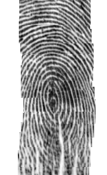
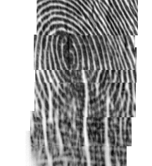

# A fork of libfrpint with ElanTech fingerprint reader driver

Original libfprint readme is in [README](README)

## Supported readers

`04f3: 0903, 0907, 0c01-0c33`

## Trying it out

```
git clone git@github.com:iafilatov/libfprint.git
cd libfprint
./autogen.sh
make
```

### Capture

> This may require root

```
examples/img_capture
```

Then open `finger.pgm` with an image viewer.


### Try enrolling and verifying

```
examples/enroll
examples/verify
```

Last enrolled image is stored in `enrolled.pgm`, last one used for verification is `verify.pgm`.

### Try with fprint_demo

[Install fprint_demo.](https://www.freedesktop.org/wiki/Software/fprint/Download/)

```
LD_LIBRARY_PATH=./libfprint/.libs/ fprint_demo
```

## Installing

Running `./configure` disables debug logging which you probably don't want all over your system logs.

```
./autogen.sh
./configure
make
sudo make install
```

Now you can use it with [fprintd](https://www.freedesktop.org/wiki/Software/fprint/fprintd/). Don't forget to enroll: `fprintd-enroll`.

> `frpintd-enroll` and `fprintd-verify` are separate from `examples/enroll` and `examples/verify`.

## Common problems

The algorithm which libfprint uses to match fingerprints doesn't like small images like the ones these drivers produce. There's just not enough minutiae (recognizable print-specific points) on them for a reliable match. This means that unless another matching algo is found/implemented, these readers will not work as good with libfprint as they do with vendor drivers.

To get bigger images the driver expects you to swipe the finger over the reader. This works quite well for readers with a rectangular 144x64 sensor. Worse than real swipe readers but good enough for day-to-day use. It needs a steady and relatively slow swipe. There are also square 96x96 sensors and I don't know whether they are in fact usable or not because I don't have one. I imagine they'd be less reliable because the resulting image is even smaller. If they can't be made usable with libfprint, I might end up dropping them because it's better than saying they work when they don't.

*Most enrolling and verification problems are caused by bad quality of scans*. Check various `*.pgm` files to see what's wrong.


### 0x0903

Elan 0x0903 has a strange issue with this driver: it frequently locks up on enroll after having passed a number of steps. A power-cycle is needed to recover it (most likely a reboot because it's often bult into touchpad on laptops). I don't know what causes it. Logs don't indicate any specific command or conditions. And my options are very limited because I don't own 0x0903 and can't reproduce the problem in any way. So far my understanding is that some people face the problem pretty consistently while other don't. I have plenty of reports from those who do, so please **if you have 0x0903 and can enroll multiple times without problems**, make an issue here and paste some logs. Maybe I can see what's different. If you're willing to hack a bit and see if you can fix it, reach out and I'll help with whatever I can. Many people would appreciate it.


### Good image



### Touch instead of swipe


Part of log from `example/enroll`:
```
...
assembling:debug [do_movement_estimation] calc delta completed in 0.151993 secs
assembling:debug [do_movement_estimation] calc delta completed in 0.145175 secs
assembling:debug [fpi_do_movement_estimation] errors: 164713 rev: 163875
assembling:debug [fpi_assemble_frames] height is -20              <-- height too small (abs value)
fp:debug [fpi_img_new] length=15120
fp:debug [fpi_imgdev_image_captured]
fp:debug [fpi_img_detect_minutiae] minutiae scan completed in 0.003507 secs
fp:debug [fpi_img_detect_minutiae] detected 4 minutiae
fp:debug [print_data_new] driver=15 devtype=0000
fp:debug [fpi_imgdev_image_captured] not enough minutiae, 4/10    <-- can't get enough minutiae
...
sync:debug [fp_enroll_finger_img] enroll should retry
fp:debug [fp_img_save_to_file] written to 'enrolled.pgm'
Wrote scanned image to enrolled.pgm
Didn't quite catch that. Please try again.
```

### Finger moved too fast



If you swipe too fast, frames don't cover the fingerprint without gaps. Try swiping along the entire fingerprint in no less than 2 sec.

### Rotated reader

Some readers have square sensors and since they are in fact touch type, there's no difference how they are installed in relation to the user. The driver assumes a certain orientation but since in can't know for sure, sometimes the orientation is wrong and the the frames are assembled incorrectly.


Since in theory the same reader can be installed differently, there's no good way to deal with this problem at the moment. If you have it, please open an issue and include your device id and short description (e.g laptop model if the reader is integrated or model if it's a separate USB device).
